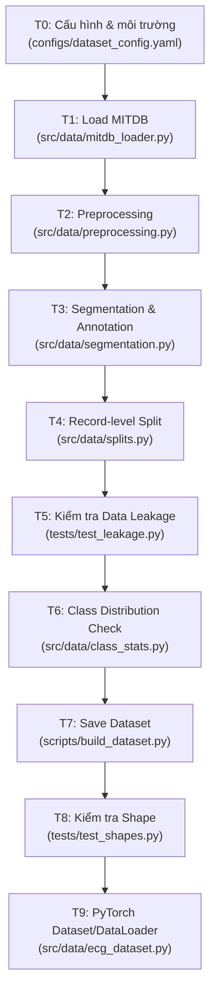

# Phase 1 Implementation Plan: MITDB Classification Dataset

## Mục tiêu

Xây dựng pipeline hoàn chỉnh để tạo dataset từ MIT-BIH Arrhythmia Database (MITDB), sẵn sàng để train MLP và 1D-CNN phân loại 5 lớp nhịp tim theo chuẩn AAMI EC57.  
**Không bao gồm:** NSTDB, denoising, Wavelet, ResNet, Autoencoder, Transformer, PTB-XL.

## Thông số môi trường đã xác nhận

| Thông số | Giá trị |
|----------|---------|
| Python | 3.9.17 |
| MITDB source | Local — `C:\d2l-en\data\ECG_Project_Data\mitdb` |
| Preprocessing | Bandpass Butterworth hoặc FIR `[0.5 Hz – 60 Hz]` |
| Framework | PyTorch (xem requirements.txt) |

---

## Tổng quan kiến trúc pipeline



---

## User Review Required

> [!IMPORTANT]
> **Validation split:** Plan dùng 4 records cụ thể cho val: `203, 220, 223, 230`. Nếu bạn muốn dùng k-fold CV trên DS1 thay vì fixed split → cần thay đổi T4.

> [!NOTE]
> **Bandpass filter đã được chọn:** Dùng bandpass `[0.5 Hz – 60 Hz]` thay vì high-pass + notch riêng. Điều này đồng thời loại baseline wander (<0.5 Hz) và powerline noise (>60 Hz) trong 1 bước. Hai lựa chọn: Butterworth IIR (nhanh hơn) hoặc FIR (zero-phase tự nhiên, không cần filtfilt). Plan cung cấp cả hai; **Butterworth là default**.

> [!WARNING]
> **Oversampling F và Q:** Plan thực hiện random oversampling cho class F và Q **chỉ trên tập train**, sau khi split. Nếu oversampling trước khi split sẽ gây data leakage.

---

## Open Questions

> [!NOTE]
> **✓ Đã xác nhận:** MITDB local tại `C:\d2l-en\data\ECG_Project_Data\mitdb`. Config sẽ dùng `source: "local"` và `local_path` tương ứng.

> [!WARNING]
> **`torch==2.12.1` trong requirements.txt** có vẻ là version không tồn tại. Khi implement sẽ dùng version thực tế đã cài — không cần thay đổi plan.

---

## Proposed Changes

### Cấu trúc thư mục sau khi hoàn thành Phase 1

```
Denoise-Clasify_ECG/
├── configs/
│   ├── config.yaml                     [MODIFY] thêm dataset section
│   └── dataset_config.yaml             [NEW]
├── src/
│   ├── data/                           [NEW DIR]
│   │   ├── __init__.py                 [NEW]
│   │   ├── mitdb_loader.py             [NEW]  -- T1
│   │   ├── preprocessing.py            [NEW]  -- T2
│   │   ├── segmentation.py             [NEW]  -- T3
│   │   ├── splits.py                   [NEW]  -- T4
│   │   ├── class_stats.py              [NEW]  -- T6
│   │   └── ecg_dataset.py              [NEW]  -- T9
│   └── dataset.py                      [MODIFY] giữ nguyên ECGDenoisingDataset, thêm import ECGClassificationDataset
├── scripts/
│   └── build_dataset.py                [NEW]  -- T7
├── tests/
│   ├── test_leakage.py                 [NEW]  -- T5
│   └── test_shapes.py                  [NEW]  -- T8
└── data/
    ├── raw/
    │   └── mitdb/                      (WFDB files .hea .dat .atr)
    ├── processed/
    │   ├── train.npz
    │   ├── val.npz
    │   └── test.npz
    └── metadata/
        └── dataset_info.json
```

---

## Task Chi Tiết

---

### T0 — Cấu hình & Môi trường

| Mục | Nội dung |
|-----|---------|
| **File tạo/sửa** | `configs/dataset_config.yaml` [NEW], `configs/config.yaml` [MODIFY] |
| **Mục tiêu** | Định nghĩa tất cả hyperparameter của dataset pipeline trong 1 file config duy nhất. Không hardcode bất kỳ constant nào trong code. |
| **Đầu vào** | — |
| **Đầu ra** | `dataset_config.yaml` chứa đầy đủ các tham số pipeline |

#### [NEW] `configs/dataset_config.yaml`

```yaml
# Phase 1 Dataset Configuration
database:
  name: "mitdb"
  source: "local"                              # ✓ xác nhận: dùng local
  local_path: "C:/d2l-en/data/ECG_Project_Data/mitdb"

signal:
  sampling_rate: 360
  lead: "MLII"
  channel_index: 0

window:
  size: 260
  before_r: 99
  after_r: 161

preprocessing:
  filter_type: "butterworth"     # "butterworth" (IIR) hoặc "fir"
  lowcut_hz: 0.5                 # ✓ cắt thấp: loại baseline wander
  highcut_hz: 60.0               # ✓ cắt cao: loại powerline noise
  # Butterworth IIR params:
  butterworth_order: 4           # order 4 cho bandpass (thực tế 8-pole)
  # FIR params:
  fir_numtaps: 101               # số tap cho FIR (phải lẻ)
  normalization: "per_beat_zscore"

aami_mapping:
  N: [N, L, R, e, j]          # class 0
  S: [A, a, J, S]             # class 1
  V: [V, E]                   # class 2
  F: [F]                      # class 3
  Q: [/, f, Q]                # class 4

excluded_records: [102, 104, 107, 217]

splits:
  train_records: [101, 106, 108, 109, 112, 114, 115, 116, 118, 119,
                  122, 124, 201, 205, 207, 208, 209, 215]
  val_records:   [203, 220, 223, 230]
  test_records:  [100, 103, 105, 111, 113, 117, 121, 123,
                  200, 202, 210, 212, 213, 214, 219, 221, 222, 228, 231, 232, 233, 234]

imbalance:
  strategy: "class_weight"     # primary
  oversample_classes: [3, 4]   # F(3) và Q(4) thêm random oversampling
  oversample_ratio: 0.1        # tăng lên 10% của class N

paths:
  processed_dir: "data/processed"
  metadata_dir:  "data/metadata"
  raw_dir:       "data/raw/mitdb"
```

#### Cách kiểm tra T0

```bash
python -c "import yaml; cfg = yaml.safe_load(open('configs/dataset_config.yaml')); print(cfg['window']['size'])"
# Kết quả: 260
```

**Điều kiện chuyển sang T1:** File `dataset_config.yaml` load được bằng `yaml.safe_load` và tất cả key trên tồn tại.

---

### T1 — Load MITDB bằng WFDB

| Mục | Nội dung |
|-----|---------|
| **File tạo/sửa** | `src/data/mitdb_loader.py` [NEW] |
| **Mục tiêu** | Load toàn bộ 48 records của MITDB (signal + annotation) từ PhysioNet hoặc local path. Trả về iterator để xử lý từng record. |
| **Đầu vào** | `dataset_config.yaml`, WFDB files (`.hea`, `.dat`, `.atr`) |
| **Đầu ra** | Generator trả về `(record_id: str, signal: np.ndarray shape (N,), ann_samples: np.ndarray, ann_symbols: list[str])` |

#### [NEW] `src/data/mitdb_loader.py` — Skeleton

```python
"""
mitdb_loader.py
Tải signal và annotation từ MIT-BIH Arrhythmia Database.
"""
import wfdb
import numpy as np
from pathlib import Path
from typing import Generator, Tuple

# 48 record IDs của MITDB
ALL_RECORDS = [
    100, 101, 102, 103, 104, 105, 106, 107, 108, 109,
    111, 112, 113, 114, 115, 116, 117, 118, 119, 121,
    122, 123, 124, 200, 201, 202, 203, 205, 207, 208,
    209, 210, 212, 213, 214, 215, 217, 219, 220, 221,
    222, 223, 228, 230, 231, 232, 233, 234
]

def load_record(record_id: int, channel_idx: int = 0,
                source: str = "local",
                local_path: str = r"C:\d2l-en\data\ECG_Project_Data\mitdb"
                ) -> Tuple[np.ndarray, np.ndarray, list]:
    """
    Load 1 record: signal (channel_idx) + annotation.

    Args:
        record_id:   int, ví dụ 100
        channel_idx: 0 = MLII (default)
        source:      'local' (default) hoặc 'physionet'
        local_path:  Path đến thư mục chứa .hea/.dat/.atr
    Returns:
        signal:      np.ndarray float64, shape (N,)
        ann_samples: np.ndarray int64,   R-peak positions
        ann_symbols: list[str],          annotation symbols
    """
    rec_str = str(record_id)

    if source == "physionet":
        record = wfdb.rdrecord(rec_str, pn_dir='mitdb')
        ann    = wfdb.rdann  (rec_str, 'atr', pn_dir='mitdb')
    else:
        # Local source — ✓ path đã xác nhận
        rec_path = Path(local_path) / rec_str
        record   = wfdb.rdrecord(str(rec_path))
        ann      = wfdb.rdann  (str(rec_path), 'atr')
    
    signal      = record.p_signal[:, channel_idx]  # MLII
    ann_samples = ann.sample
    ann_symbols = ann.symbol
    
    return signal, ann_samples, ann_symbols


def iter_records(record_ids: list, channel_idx: int = 0,
                 source: str = "local",
                 local_path: str = r"C:\d2l-en\data\ECG_Project_Data\mitdb") -> Generator:
    """Iterate qua danh sách records, yield từng record."""
    for rec_id in record_ids:
        signal, ann_samples, ann_symbols = load_record(
            rec_id, channel_idx, source, local_path
        )
        yield rec_id, signal, ann_samples, ann_symbols
```

#### Cách kiểm tra T1

```python
from src.data.mitdb_loader import load_record

# Test với local path đã xác nhận
signal, samples, symbols = load_record(
    100,
    source='local',
    local_path=r'C:\d2l-en\data\ECG_Project_Data\mitdb'
)
assert signal.ndim == 1,             "Signal phải là 1D array"
assert signal.shape[0] == 650000,    "Record 100 có 650,000 samples"
assert len(samples) == len(symbols), "len(samples) == len(symbols)"
assert len(samples) > 0,             "Phải có ít nhất 1 annotation"
print(f"✓ Record 100: signal={signal.shape}, n_beats={len(samples)}")
```

**Điều kiện chuyển sang T2:** `load_record(100)` trả về signal shape `(650000,)` không lỗi. `load_record(234)` cũng thành công (record cuối).

---

### T2 — Preprocessing Tối Thiểu

| Mục | Nội dung |
|-----|---------|
| **File tạo/sửa** | `src/data/preprocessing.py` [NEW — hiện tại file rỗng] |
| **Mục tiêu** | Áp dụng high-pass filter loại baseline wander lên raw signal trước khi segmentation. Per-beat Z-score normalization sẽ làm trong T3. |
| **Đầu vào** | `signal: np.ndarray shape (N,)` float64, `fs=360`, params từ config |
| **Đầu ra** | `filtered_signal: np.ndarray shape (N,)` float64 |

#### [NEW] `src/data/preprocessing.py`

> **Quyết định thiết kế:** Dùng bandpass `[0.5 – 60 Hz]` kết hợp cả 2 tác dụng:
> - Loại **baseline wander** (< 0.5 Hz)
> - Loại **powerline noise** (> 60 Hz)  
>
> Cung cấp 2 lựa chọn filter: **Butterworth IIR** (default — nhanh, phù hợp Python 3.9 + scipy) và **FIR** (linear phase tự nhiên, không cần filtfilt).

```python
"""
preprocessing.py
Preprocessing Phase 1: Bandpass filter [0.5–60 Hz] + per-beat Z-score.
Python 3.9.17 compatible (scipy >= 1.7).
"""
import numpy as np
from scipy.signal import butter, filtfilt, firwin, lfilter
from typing import Literal


def bandpass_butterworth(
    signal: np.ndarray,
    lowcut: float = 0.5,
    highcut: float = 60.0,
    fs: float = 360.0,
    order: int = 4,
) -> np.ndarray:
    """
    Bandpass Butterworth IIR filter [lowcut, highcut] Hz.
    Dùng filtfilt (zero-phase, forward-backward) để không gây phase shift.

    Lưu ý: order=4 với bandpass tạo ra bộ lọc 8-pole thực tế.
    Butterworth rất phổ biến trong ECG processing vì maximally flat passband.

    Args:
        signal:  1D float array, ECG signal thô
        lowcut:  lower cutoff Hz  (default 0.5 — loại baseline wander)
        highcut: upper cutoff Hz  (default 60.0 — loại powerline noise)
        fs:      sampling rate Hz (MITDB = 360)
        order:   filter order     (default 4)
    Returns:
        filtered: 1D float64 array, cùng shape với signal
    """
    nyq  = fs / 2.0
    low  = lowcut  / nyq
    high = highcut / nyq
    b, a = butter(order, [low, high], btype='band', analog=False)
    return filtfilt(b, a, signal).astype(np.float64)


def bandpass_fir(
    signal: np.ndarray,
    lowcut: float = 0.5,
    highcut: float = 60.0,
    fs: float = 360.0,
    numtaps: int = 101,
) -> np.ndarray:
    """
    Bandpass FIR filter [lowcut, highcut] Hz dùng windowed-sinc (Hamming).
    FIR có linear phase tự nhiên — không cần filtfilt.
    numtaps phải lẻ để filter có độ trễ nguyên mẫu (symmetric).

    Args:
        signal:  1D float array
        lowcut:  lower cutoff Hz
        highcut: upper cutoff Hz
        fs:      sampling rate Hz
        numtaps: số taps (phải lẻ, default 101)
    Returns:
        filtered: 1D float64 array, có độ trễ (numtaps-1)//2 mẫu
                  (không ảnh hưởng vì ta chỉ dùng R-peak positions từ annotation)
    """
    assert numtaps % 2 == 1, "numtaps phải là số lẻ"
    nyq  = fs / 2.0
    b    = firwin(numtaps, [lowcut / nyq, highcut / nyq], pass_zero=False)
    return lfilter(b, 1.0, signal).astype(np.float64)


def preprocess_signal(
    signal: np.ndarray,
    filter_type: Literal['butterworth', 'fir'] = 'butterworth',
    lowcut: float = 0.5,
    highcut: float = 60.0,
    fs: float = 360.0,
    butterworth_order: int = 4,
    fir_numtaps: int = 101,
) -> np.ndarray:
    """
    Entry point duy nhất cho preprocessing signal.
    Áp dụng bandpass filter [lowcut, highcut] Hz.

    Args:
        signal:           Raw ECG signal, 1D array
        filter_type:      'butterworth' (default) hoặc 'fir'
        lowcut:           0.5 Hz
        highcut:          60.0 Hz
        fs:               360.0 Hz
        butterworth_order: 4
        fir_numtaps:      101
    Returns:
        filtered signal, 1D float64
    """
    if filter_type == 'butterworth':
        return bandpass_butterworth(signal, lowcut, highcut, fs, butterworth_order)
    elif filter_type == 'fir':
        return bandpass_fir(signal, lowcut, highcut, fs, fir_numtaps)
    else:
        raise ValueError(f"filter_type phải là 'butterworth' hoặc 'fir', got '{filter_type}'")


def zscore_normalize(window: np.ndarray, eps: float = 1e-8) -> np.ndarray:
    """
    Per-beat Z-score normalization.
    window: 1D array (260,)  →  mean=0, std=1
    """
    mean = np.mean(window)
    std  = np.std(window)
    return (window - mean) / (std + eps)
```

#### Cách kiểm tra T2

```python
import numpy as np
from src.data.preprocessing import preprocess_signal, zscore_normalize

rng = np.random.default_rng(42)

# Test 1: Butterworth bandpass loại DC offset + giả lập powerline
signal = rng.standard_normal(650000) + 500.0   # DC offset lớn
# Thêm 60 Hz powerline noise
t = np.arange(650000) / 360.0
signal += 0.5 * np.sin(2 * np.pi * 60 * t)

filtered_bw = preprocess_signal(signal, filter_type='butterworth')
assert abs(np.mean(filtered_bw)) < 1.0,           "Mean sau Butterworth phải gần 0"
assert filtered_bw.shape == signal.shape,          "Shape không đổi"

# Test 2: FIR bandpass
filtered_fir = preprocess_signal(signal, filter_type='fir')
assert abs(np.mean(filtered_fir)) < 1.0,           "Mean sau FIR phải gần 0"
assert filtered_fir.shape == signal.shape,         "Shape không đổi"

# Test 3: filter_type không hợp lệ phải raise ValueError
try:
    preprocess_signal(signal, filter_type='invalid')
    assert False, "Phải raise ValueError"
except ValueError:
    pass

# Test 4: Z-score normalization
window = rng.standard_normal(260) * 5 + 100
normed = zscore_normalize(window)
assert abs(np.mean(normed)) < 1e-6,               "mean phải ≈ 0"
assert abs(np.std(normed) - 1.0) < 1e-6,          "std phải ≈ 1"

print("✓ Preprocessing tests passed (Butterworth + FIR + Z-score)")
```

**Điều kiện chuyển sang T3:** Tất cả 4 tests pass. Không có ImportError.

---

### T3 — Segmentation & Annotation/Label

| Mục | Nội dung |
|-----|---------|
| **File tạo/sửa** | `src/data/segmentation.py` [NEW] |
| **Mục tiêu** | Cắt window quanh từng R-peak, lọc beat-only annotations, map sang AAMI 5-class, normalize per-beat. Trả về (X, y, meta) cho 1 record. |
| **Đầu vào** | `signal` (filtered), `ann_samples`, `ann_symbols`, params từ config |
| **Đầu ra** | `X: np.ndarray (N_beats, 260) float32`, `y: np.ndarray (N_beats,) int32`, `meta: dict` |

#### [NEW] `src/data/segmentation.py`

```python
"""
segmentation.py
R-peak centered beat segmentation + AAMI mapping + per-beat normalization.
"""
import numpy as np
from typing import Tuple, Dict

# AAMI EC57 mapping — nguồn: de Chazal 2004
AAMI_MAP: Dict[str, int] = {
    'N': 0, 'L': 0, 'R': 0, 'e': 0, 'j': 0,  # Normal
    'A': 1, 'a': 1, 'J': 1, 'S': 1,            # SVEB
    'V': 2, 'E': 2,                              # VEB
    'F': 3,                                       # Fusion
    '/': 4, 'f': 4, 'Q': 4,                      # Unknown
}

CLASS_NAMES = {0: 'N', 1: 'S', 2: 'V', 3: 'F', 4: 'Q'}

BEFORE_R = 99
AFTER_R  = 161   # total window = 260


def segment_record(signal: np.ndarray,
                   ann_samples: np.ndarray,
                   ann_symbols: list,
                   record_id: int,
                   before_r: int = BEFORE_R,
                   after_r: int = AFTER_R,
                   eps: float = 1e-8
                   ) -> Tuple[np.ndarray, np.ndarray, dict]:
    """
    Segment một record thành beats.

    Returns:
        X:    (N_beats, window_size) float32
        y:    (N_beats,)             int32
        meta: {record_ids, beat_indices, original_symbols}
    """
    beats_X     = []
    beats_y     = []
    beat_idx    = []
    orig_syms   = []
    
    sig_len      = len(signal)
    window_size  = before_r + after_r
    
    for r_pos, sym in zip(ann_samples, ann_symbols):
        # Bỏ qua annotation không phải beat (rhythm markers, etc.)
        if sym not in AAMI_MAP:
            continue
        
        start = int(r_pos) - before_r
        end   = int(r_pos) + after_r
        
        # Boundary check — bỏ beats gần biên
        if start < 0 or end > sig_len:
            continue
        
        window = signal[start:end].copy()        # (260,)
        
        # Per-beat Z-score normalization
        mean = np.mean(window)
        std  = np.std(window)
        window = (window - mean) / (std + eps)
        
        beats_X.append(window.astype(np.float32))
        beats_y.append(AAMI_MAP[sym])
        beat_idx.append(int(r_pos))
        orig_syms.append(sym)
    
    if len(beats_X) == 0:
        X   = np.empty((0, window_size), dtype=np.float32)
        y   = np.empty((0,),             dtype=np.int32)
    else:
        X   = np.stack(beats_X, axis=0).astype(np.float32)   # (N, 260)
        y   = np.array(beats_y,  dtype=np.int32)
    
    meta = {
        'record_ids':       np.full(len(beats_y), record_id, dtype=np.int32),
        'beat_indices':     np.array(beat_idx, dtype=np.int64),
        'original_symbols': orig_syms,
    }
    
    return X, y, meta
```

#### Cách kiểm tra T3

```python
import wfdb, numpy as np
from src.data.preprocessing import preprocess_signal
from src.data.segmentation import segment_record, AAMI_MAP

record = wfdb.rdrecord('100', pn_dir='mitdb')
ann    = wfdb.rdann  ('100', 'atr', pn_dir='mitdb')
signal = preprocess_signal(record.p_signal[:, 0])

X, y, meta = segment_record(signal, ann.sample, ann.symbol, record_id=100)

# Kiểm tra shape
assert X.ndim == 2,          "X phải là 2D"
assert X.shape[1] == 260,    "window size phải là 260"
assert y.ndim == 1,          "y phải là 1D"
assert X.shape[0] == y.shape[0], "N_beats phải nhất quán"
assert X.dtype == np.float32,    "X dtype phải float32"
assert y.dtype == np.int32,      "y dtype phải int32"

# Kiểm tra label hợp lệ
assert set(np.unique(y)).issubset({0,1,2,3,4}), "y chỉ chứa {0,1,2,3,4}"

# Kiểm tra normalization
for i in range(min(100, len(X))):
    assert abs(np.mean(X[i])) < 0.01, f"mean beat {i} không gần 0"
    assert abs(np.std(X[i]) - 1.0) < 0.1, f"std beat {i} không gần 1"

print(f"✓ Record 100: {X.shape[0]} beats, classes={np.unique(y)}")
```

**Điều kiện chuyển sang T4:** `X.shape[1] == 260`, `y` chỉ chứa giá trị trong `{0,1,2,3,4}`, `X.dtype == float32`, `y.dtype == int32`. Không có beat nào bị cắt không hợp lệ.

---

### T4 — Record/Patient-Level Split

| Mục | Nội dung |
|-----|---------|
| **File tạo/sửa** | `src/data/splits.py` [NEW] |
| **Mục tiêu** | Phân chia 44 records theo inter-patient protocol De Chazal 2004 (DS1/DS2). Trả về dict của record lists cho train/val/test. Không bao giờ random split theo beat. |
| **Đầu vào** | `dataset_config.yaml` |
| **Đầu ra** | `dict: {'train': [...], 'val': [...], 'test': [...]}` |

#### [NEW] `src/data/splits.py`

```python
"""
splits.py
Inter-patient split theo De Chazal 2004 (DS1/DS2 protocol).
"""
from typing import Dict, List

# DS1 = 22 records — dùng để train + val
DS1 = [101, 106, 108, 109, 112, 114, 115, 116, 118, 119,
       122, 124, 201, 203, 205, 207, 208, 209, 215, 220, 223, 230]

# DS2 = 22 records — chỉ dùng để test cuối
DS2 = [100, 103, 105, 111, 113, 117, 121, 123,
       200, 202, 210, 212, 213, 214, 219, 221, 222, 228, 231, 232, 233, 234]

# 4 records loại ra (paced beats)
EXCLUDED = [102, 104, 107, 217]

# Trong DS1, tách 4 records làm validation
VAL_RECORDS   = [203, 220, 223, 230]
TRAIN_RECORDS = [r for r in DS1 if r not in VAL_RECORDS]


def get_split_records() -> Dict[str, List[int]]:
    """
    Trả về danh sách record IDs cho từng split.
    Đây là phân chia cố định — không random.
    """
    # Sanity checks
    assert set(TRAIN_RECORDS) & set(VAL_RECORDS) == set(), \
        "Train và Val records bị overlap!"
    assert set(DS1) & set(DS2) == set(), \
        "DS1 và DS2 bị overlap!"
    assert set(EXCLUDED) & set(DS1 + DS2) == set(), \
        "Excluded records vẫn còn trong DS1/DS2!"
    
    return {
        'train': sorted(TRAIN_RECORDS),
        'val':   sorted(VAL_RECORDS),
        'test':  sorted(DS2),
    }


def get_all_44_records() -> List[int]:
    """44 records hợp lệ (loại 4 paced records)."""
    return sorted(DS1 + DS2)
```

#### Cách kiểm tra T4

```python
from src.data.splits import get_split_records, DS1, DS2, EXCLUDED

splits = get_split_records()

# Số lượng
assert len(splits['train']) == 18, f"Train phải có 18 records, got {len(splits['train'])}"
assert len(splits['val'])   ==  4, f"Val phải có 4 records, got {len(splits['val'])}"
assert len(splits['test'])  == 22, f"Test phải có 22 records, got {len(splits['test'])}"

# Không có overlap giữa bất kỳ cặp nào
all_sets = [set(splits['train']), set(splits['val']), set(splits['test'])]
assert all_sets[0] & all_sets[1] == set(), "Train-Val overlap!"
assert all_sets[0] & all_sets[2] == set(), "Train-Test overlap!"
assert all_sets[1] & all_sets[2] == set(), "Val-Test overlap!"

# Excluded records không xuất hiện
all_used = set(splits['train'] + splits['val'] + splits['test'])
assert not any(r in all_used for r in EXCLUDED), "Paced records còn trong split!"

# Tổng phải là 44
assert len(all_used) == 44, f"Tổng phải là 44, got {len(all_used)}"

print("✓ Split checks passed")
print(f"  Train: {splits['train']}")
print(f"  Val:   {splits['val']}")
print(f"  Test:  {splits['test']}")
```

**Điều kiện chuyển sang T5:** Tất cả assert trên đều pass. `len(train)==18`, `len(val)==4`, `len(test)==22`, tổng = 44.

---

### T5 — Kiểm Tra Data Leakage ⚠️

> [!CAUTION]
> **Task bắt buộc.** Data leakage là lỗi nghiêm trọng nhất. Task này phải pass hoàn toàn trước khi tiếp tục.

| Mục | Nội dung |
|-----|---------|
| **File tạo/sửa** | `tests/test_leakage.py` [NEW] |
| **Mục tiêu** | Xác minh một cách lập trình rằng: (1) không có record nào xuất hiện ở 2 split, (2) không có beat index nào từ cùng 1 record xuất hiện ở 2 split khác nhau, (3) các file NPZ sau khi save không chứa record_id bị trùng. |
| **Đầu vào** | `src/data/splits.py`, sau T7: các file `train.npz`, `val.npz`, `test.npz` |
| **Đầu ra** | Pass/Fail report — mọi test đều phải PASS |

#### [NEW] `tests/test_leakage.py`

```python
"""
test_leakage.py
Kiểm tra toàn diện data leakage cho Phase 1 MITDB dataset.

Chạy:
    python -m pytest tests/test_leakage.py -v
hoặc:
    python tests/test_leakage.py
"""
import numpy as np
from pathlib import Path
from src.data.splits import get_split_records, EXCLUDED

PROCESSED_DIR = Path("data/processed")


# ── Level 1: Record-level split integrity ──────────────────────────────────

def test_no_record_overlap_in_split_definition():
    """Định nghĩa split trong code không có overlap."""
    splits = get_split_records()
    train  = set(splits['train'])
    val    = set(splits['val'])
    test   = set(splits['test'])
    
    assert train & val  == set(), f"Train-Val overlap: {train & val}"
    assert train & test == set(), f"Train-Test overlap: {train & test}"
    assert val   & test == set(), f"Val-Test overlap: {val & test}"


def test_excluded_records_not_in_any_split():
    """Paced records (102,104,107,217) không được xuất hiện trong bất kỳ split."""
    splits    = get_split_records()
    used      = set(splits['train'] + splits['val'] + splits['test'])
    excluded  = set(EXCLUDED)
    
    assert excluded & used == set(), \
        f"Paced records xuất hiện trong split: {excluded & used}"


def test_total_records_count():
    """Tổng số records sau khi split phải là 44."""
    splits = get_split_records()
    total  = len(splits['train']) + len(splits['val']) + len(splits['test'])
    assert total == 44, f"Tổng phải là 44, got {total}"


# ── Level 2: NPZ file record_id integrity ──────────────────────────────────

def test_npz_record_ids_no_overlap():
    """
    Sau khi build dataset (T7), mỗi record_id chỉ xuất hiện trong
    đúng 1 split. Kiểm tra 3 file NPZ.
    
    SKIP nếu file chưa tồn tại (chạy sau T7).
    """
    files = {
        'train': PROCESSED_DIR / 'train.npz',
        'val':   PROCESSED_DIR / 'val.npz',
        'test':  PROCESSED_DIR / 'test.npz',
    }
    
    for split_name, fp in files.items():
        if not fp.exists():
            print(f"  SKIP {split_name}: {fp} chưa tồn tại")
            return
    
    train_ids = set(np.load(files['train'])['record_ids'].tolist())
    val_ids   = set(np.load(files['val'])  ['record_ids'].tolist())
    test_ids  = set(np.load(files['test']) ['record_ids'].tolist())
    
    assert train_ids & val_ids  == set(), \
        f"LEAKAGE! Record IDs xuất hiện ở cả Train và Val: {train_ids & val_ids}"
    assert train_ids & test_ids == set(), \
        f"LEAKAGE! Record IDs xuất hiện ở cả Train và Test: {train_ids & test_ids}"
    assert val_ids   & test_ids == set(), \
        f"LEAKAGE! Record IDs xuất hiện ở cả Val và Test: {val_ids & test_ids}"
    
    print(f"✓ NPZ record IDs: train={len(train_ids)}, val={len(val_ids)}, test={len(test_ids)}")


def test_npz_beat_indices_no_cross_patient_leak():
    """
    Mỗi (record_id, beat_index) pair chỉ xuất hiện trong 1 split.
    """
    files = {
        'train': PROCESSED_DIR / 'train.npz',
        'val':   PROCESSED_DIR / 'val.npz',
        'test':  PROCESSED_DIR / 'test.npz',
    }
    
    for fp in files.values():
        if not fp.exists():
            print(f"  SKIP: NPZ files chưa tồn tại")
            return
    
    def get_pairs(fp):
        data = np.load(fp)
        return set(zip(data['record_ids'].tolist(), data['beat_indices'].tolist()))
    
    train_pairs = get_pairs(files['train'])
    val_pairs   = get_pairs(files['val'])
    test_pairs  = get_pairs(files['test'])
    
    tv = train_pairs & val_pairs
    tt = train_pairs & test_pairs
    vt = val_pairs   & test_pairs
    
    assert len(tv) == 0, f"LEAKAGE! {len(tv)} (record,beat) pairs trùng Train-Val"
    assert len(tt) == 0, f"LEAKAGE! {len(tt)} (record,beat) pairs trùng Train-Test"
    assert len(vt) == 0, f"LEAKAGE! {len(vt)} (record,beat) pairs trùng Val-Test"
    
    print(f"✓ No (record, beat_index) pairs leaked between splits")


def test_expected_record_ids_per_split():
    """
    Record IDs trong NPZ phải khớp CHÍNH XÁC với định nghĩa trong splits.py.
    """
    files = {
        'train': PROCESSED_DIR / 'train.npz',
        'val':   PROCESSED_DIR / 'val.npz',
        'test':  PROCESSED_DIR / 'test.npz',
    }
    splits = get_split_records()
    
    for split_name, fp in files.items():
        if not fp.exists():
            print(f"  SKIP {split_name}: {fp} chưa tồn tại")
            return
        
        data             = np.load(fp)
        actual_ids       = set(data['record_ids'].tolist())
        expected_ids     = set(splits[split_name])
        
        assert actual_ids == expected_ids, \
            f"Split '{split_name}': expected {expected_ids}, got {actual_ids}\n" \
            f"  Missing: {expected_ids - actual_ids}\n" \
            f"  Extra: {actual_ids - expected_ids}"
    
    print("✓ Record IDs trong NPZ khớp hoàn toàn với splits.py")


if __name__ == "__main__":
    print("=== Data Leakage Tests ===\n")
    tests = [
        test_no_record_overlap_in_split_definition,
        test_excluded_records_not_in_any_split,
        test_total_records_count,
        test_npz_record_ids_no_overlap,
        test_npz_beat_indices_no_cross_patient_leak,
        test_expected_record_ids_per_split,
    ]
    passed = 0
    for t in tests:
        try:
            t()
            print(f"  ✓ PASS: {t.__name__}")
            passed += 1
        except AssertionError as e:
            print(f"  ✗ FAIL: {t.__name__}\n    {e}")
    print(f"\n{passed}/{len(tests)} tests passed")
```

#### Cách kiểm tra T5

```bash
# Level 1 (chạy ngay sau T4):
python tests/test_leakage.py
# Expected: 3/6 tests passed (level 1), 3 tests SKIP vì NPZ chưa có

# Level 2 (chạy sau T7):
python tests/test_leakage.py
# Expected: 6/6 tests passed
```

**Điều kiện chuyển sang T6:** Level 1 (3 tests đầu) phải PASS 100%. Level 2 sẽ chạy lại sau T7 và phải PASS 100%.

---

### T6 — Class Distribution Check

| Mục | Nội dung |
|-----|---------|
| **File tạo/sửa** | `src/data/class_stats.py` [NEW] |
| **Mục tiêu** | Tính và in phân phối lớp cho từng split. Tính class weights để dùng trong loss function. Cảnh báo nếu bất kỳ lớp nào có < 50 samples. |
| **Đầu vào** | `y_train`, `y_val`, `y_test` arrays sau khi segment tất cả records |
| **Đầu ra** | Bảng phân phối in ra console + `class_weights: np.ndarray shape (5,)` |

#### [NEW] `src/data/class_stats.py`

```python
"""
class_stats.py
Tính và báo cáo phân phối lớp, class weights.
"""
import numpy as np
from collections import Counter
from sklearn.utils.class_weight import compute_class_weight

CLASS_NAMES = ['N', 'S', 'V', 'F', 'Q']
N_CLASSES   = 5
MIN_SAMPLES_WARNING = 50


def print_distribution(y: np.ndarray, split_name: str) -> dict:
    """In phân phối lớp và trả về dict counts."""
    counts = Counter(y.tolist())
    total  = len(y)
    
    print(f"\n{'='*50}")
    print(f"Class Distribution — {split_name.upper()} ({total} beats)")
    print(f"{'='*50}")
    print(f"{'Class':<8} {'Name':<8} {'Count':>8} {'Ratio':>8}")
    print(f"{'-'*36}")
    
    for cls_id in range(N_CLASSES):
        n     = counts.get(cls_id, 0)
        ratio = n / total * 100 if total > 0 else 0
        warn  = " ⚠ " if n < MIN_SAMPLES_WARNING else ""
        print(f"  {cls_id:<6} {CLASS_NAMES[cls_id]:<8} {n:>8,} {ratio:>7.2f}%{warn}")
    
    return dict(counts)


def compute_weights(y_train: np.ndarray) -> np.ndarray:
    """
    Tính class weights cho CrossEntropyLoss.
    Dùng sklearn 'balanced' formula:
        weight[c] = N_total / (N_classes * N_c)
    """
    classes = np.arange(N_CLASSES)
    weights = compute_class_weight(
        class_weight='balanced',
        classes=classes,
        y=y_train
    )
    print("\nClass Weights (cho CrossEntropyLoss):")
    for cls_id, w in enumerate(weights):
        print(f"  Class {cls_id} ({CLASS_NAMES[cls_id]}): {w:.4f}")
    return weights.astype(np.float32)


def check_minimum_samples(y: np.ndarray, split_name: str,
                          min_samples: int = MIN_SAMPLES_WARNING):
    """Cảnh báo nếu bất kỳ lớp nào quá ít samples."""
    counts = Counter(y.tolist())
    issues = []
    for cls_id in range(N_CLASSES):
        n = counts.get(cls_id, 0)
        if n < min_samples:
            issues.append(f"Class {cls_id} ({CLASS_NAMES[cls_id]}): {n} samples < {min_samples}")
    
    if issues:
        print(f"\n⚠ WARNING [{split_name}]: Các lớp có quá ít samples:")
        for msg in issues:
            print(f"   {msg}")
    return issues
```

#### Cách kiểm tra T6

Sau khi segment tất cả records, gọi:
```python
from src.data.class_stats import print_distribution, compute_weights, check_minimum_samples

# Expected (theo de Chazal 2004):
# Train: N ~72k, S ~2k, V ~5k, F ~600, Q ~10
# Val:   N ~9k,  S ~300, V ~700, F ~100, Q ~5
# Test:  N ~18k, S ~480, V ~1.3k, F ~103, Q ~5
```

Kiểm tra bằng mắt:
- Tổng beats (train+val+test) ≈ 100,000–105,000 (theo literature)  
- Lớp N chiếm ~89%  
- Lớp Q cực kỳ ít (< 20 mẫu) → phải có warning  
- Class weights: N ≈ 0.1–0.2, Q ≈ 50–100

**Điều kiện chuyển sang T7:** Phân phối in ra hợp lý theo kỳ vọng từ literature. Class weights được tính thành công (không NaN, không Inf).

---

### T7 — Save Dataset

| Mục | Nội dung |
|-----|---------|
| **File tạo/sửa** | `scripts/build_dataset.py` [NEW] |
| **Mục tiêu** | Script chính điều phối toàn bộ pipeline: load → preprocess → segment → split → (oversampling F/Q) → save NPZ + JSON metadata. Entry point duy nhất để build dataset. |
| **Đầu vào** | `configs/dataset_config.yaml`, MITDB data (PhysioNet hoặc local) |
| **Đầu ra** | `data/processed/train.npz`, `data/processed/val.npz`, `data/processed/test.npz`, `data/metadata/dataset_info.json` |

#### [NEW] `scripts/build_dataset.py` — Flow chính

```python
"""
build_dataset.py
Entry point để build MITDB classification dataset cho Phase 1.

Chạy:
    python scripts/build_dataset.py --config configs/dataset_config.yaml
"""
import argparse
import json
import numpy as np
from pathlib import Path
from datetime import datetime
from tqdm import tqdm

import yaml

from src.data.mitdb_loader   import iter_records
from src.data.preprocessing  import preprocess_signal
from src.data.segmentation   import segment_record
from src.data.splits         import get_split_records
from src.data.class_stats    import print_distribution, compute_weights


def oversample_minority(X, y, meta, classes_to_oversample, ratio=0.1):
    """
    Random oversampling cho các lớp thiểu số (F, Q).
    ratio: tỷ lệ mong muốn so với class N.
    Chỉ áp dụng trên training set.
    """
    from collections import Counter
    counts = Counter(y.tolist())
    n_majority = counts[0]  # class N
    
    X_extra, y_extra, meta_extra = [], [], {k: [] for k in meta}
    
    for cls_id in classes_to_oversample:
        n_current = counts.get(cls_id, 0)
        n_target  = int(n_majority * ratio)
        
        if n_current == 0 or n_current >= n_target:
            continue
        
        n_extra = n_target - n_current
        idxs    = np.where(y == cls_id)[0]
        chosen  = np.random.choice(idxs, size=n_extra, replace=True)
        
        X_extra.append(X[chosen])
        y_extra.append(y[chosen])
        for k in meta:
            if k == 'original_symbols':
                meta_extra[k].extend([meta[k][i] for i in chosen])
            else:
                meta_extra[k].append(meta[k][chosen])
    
    if X_extra:
        X = np.vstack([X] + X_extra)
        y = np.concatenate([y] + y_extra)
    
    return X, y


def build_split(record_ids, cfg, split_name):
    """Build X, y, meta cho 1 split."""
    X_all, y_all = [], []
    rec_ids_all, beat_idx_all, orig_syms_all = [], [], []
    
    source     = cfg['database']['source']
    local_path = cfg['database'].get('local_path')
    ch_idx     = cfg['signal']['channel_index']
    pp_cfg     = cfg['preprocessing']

    for rec_id, signal, ann_samples, ann_symbols in tqdm(
        iter_records(record_ids, ch_idx, source, local_path),
        total=len(record_ids), desc=f"Processing {split_name}"
    ):
        filtered = preprocess_signal(
            signal,
            filter_type=pp_cfg.get('filter_type', 'butterworth'),
            lowcut=pp_cfg.get('lowcut_hz', 0.5),
            highcut=pp_cfg.get('highcut_hz', 60.0),
            butterworth_order=pp_cfg.get('butterworth_order', 4),
            fir_numtaps=pp_cfg.get('fir_numtaps', 101),
        )
        
        X, y, meta = segment_record(
            filtered, ann_samples, ann_symbols,
            record_id=rec_id,
            before_r=cfg['window']['before_r'],
            after_r=cfg['window']['after_r'],
        )
        
        X_all.append(X)
        y_all.append(y)
        rec_ids_all.append(meta['record_ids'])
        beat_idx_all.append(meta['beat_indices'])
        orig_syms_all.extend(meta['original_symbols'])
    
    X_all = np.vstack(X_all)
    y_all = np.concatenate(y_all)
    
    return X_all, y_all, {
        'record_ids':       np.concatenate(rec_ids_all),
        'beat_indices':     np.concatenate(beat_idx_all),
        'original_symbols': orig_syms_all,
    }


def save_split(out_dir, split_name, X, y, meta):
    """Lưu 1 split thành NPZ."""
    out_path = Path(out_dir) / f"{split_name}.npz"
    np.savez_compressed(
        out_path,
        X=X,
        y=y,
        record_ids=meta['record_ids'],
        beat_indices=meta['beat_indices'],
    )
    print(f"  Saved {split_name}.npz: X={X.shape}, y={y.shape} → {out_path}")


def main():
    parser = argparse.ArgumentParser()
    parser.add_argument('--config', default='configs/dataset_config.yaml')
    parser.add_argument('--seed',   type=int, default=42)
    args = parser.parse_args()
    
    np.random.seed(args.seed)
    
    with open(args.config) as f:
        cfg = yaml.safe_load(f)
    
    splits      = get_split_records()
    processed   = Path(cfg['paths']['processed_dir'])
    metadata    = Path(cfg['paths']['metadata_dir'])
    processed.mkdir(parents=True, exist_ok=True)
    metadata.mkdir(parents=True, exist_ok=True)
    
    # Build từng split
    results = {}
    for split_name in ['train', 'val', 'test']:
        X, y, meta = build_split(splits[split_name], cfg, split_name)
        results[split_name] = (X, y, meta)
    
    # Oversampling chỉ trên train
    X_tr, y_tr, meta_tr = results['train']
    oversample_cls = cfg['imbalance'].get('oversample_classes', [])
    oversample_ratio = cfg['imbalance'].get('oversample_ratio', 0.1)
    
    if oversample_cls:
        X_tr, y_tr = oversample_minority(X_tr, y_tr, meta_tr,
                                          oversample_cls, oversample_ratio)
        print(f"\nAfter oversampling: train size = {len(y_tr)}")
    
    # Save NPZ
    print("\nSaving NPZ files...")
    save_split(processed, 'train', X_tr, y_tr, meta_tr)
    save_split(processed, 'val',   *results['val'])
    save_split(processed, 'test',  *results['test'])
    
    # Print distributions & compute weights
    weights = {}
    for split_name in ['train', 'val', 'test']:
        _, y, _ = results[split_name]
        if split_name == 'train':
            y = y_tr  # sau oversampling
        print_distribution(y, split_name)
        if split_name == 'train':
            weights['class_weights'] = compute_weights(y).tolist()
    
    # Save metadata JSON
    pp_cfg = cfg['preprocessing']
    info = {
        "version": "1.0.0",
        "created_at": datetime.now().isoformat(),
        "python_version": "3.9.17",
        "source_database": "MIT-BIH Arrhythmia Database",
        "mitdb_local_path": cfg['database'].get('local_path'),
        "excluded_records": [102, 104, 107, 217],
        "train_records": splits['train'],
        "val_records":   splits['val'],
        "test_records":  splits['test'],
        "window_size":   cfg['window']['size'],
        "before_r":      cfg['window']['before_r'],
        "after_r":       cfg['window']['after_r'],
        "sampling_rate": cfg['signal']['sampling_rate'],
        "lead":          cfg['signal']['lead'],
        "channel_index": cfg['signal']['channel_index'],
        "normalization": pp_cfg.get('normalization', 'per_beat_zscore'),
        "preprocessing": {
            "filter_type":        pp_cfg.get('filter_type', 'butterworth'),
            "lowcut_hz":          pp_cfg.get('lowcut_hz', 0.5),
            "highcut_hz":         pp_cfg.get('highcut_hz', 60.0),
            "butterworth_order":  pp_cfg.get('butterworth_order', 4),
            "fir_numtaps":        pp_cfg.get('fir_numtaps', 101),
        },
        "class_names":   ['N', 'S', 'V', 'F', 'Q'],
        "split_protocol": "De Chazal 2004 inter-patient DS1/DS2",
        "n_train_beats": int(len(y_tr)),
        "n_val_beats":   int(len(results['val'][1])),
        "n_test_beats":  int(len(results['test'][1])),
        **weights,
    }
    
    with open(metadata / "dataset_info.json", 'w') as f:
        json.dump(info, f, indent=2)
    print(f"\n✓ Metadata saved → {metadata / 'dataset_info.json'}")


if __name__ == "__main__":
    main()
```

#### Cách kiểm tra T7

```bash
python scripts/build_dataset.py --config configs/dataset_config.yaml

# Kiểm tra output:
# 1. 3 file NPZ tồn tại
python -c "from pathlib import Path; [print(p, p.stat().st_size//1024, 'KB') for p in Path('data/processed').glob('*.npz')]"

# 2. dataset_info.json tồn tại và hợp lệ
python -c "import json; info=json.load(open('data/metadata/dataset_info.json')); print(json.dumps(info, indent=2))"
```

**Điều kiện chuyển sang T8:** 3 file NPZ tồn tại với size > 0. `dataset_info.json` parse được. `n_train_beats + n_val_beats + n_test_beats ≈ 100,000`.

---

### T8 — Kiểm Tra Shape 📐

> [!IMPORTANT]
> **Task bắt buộc.** Xác minh chính xác shape của tất cả arrays trong NPZ để đảm bảo tương thích với MLP và 1D-CNN.

| Mục | Nội dung |
|-----|---------|
| **File tạo/sửa** | `tests/test_shapes.py` [NEW] |
| **Mục tiêu** | Xác minh shape, dtype, value range của X và y trong cả 3 split. Verify tương thích với MLP input `(batch, 260)` và CNN input `(batch, 1, 260)`. |
| **Đầu vào** | `data/processed/train.npz`, `val.npz`, `test.npz` |
| **Đầu ra** | Pass/Fail report |

#### [NEW] `tests/test_shapes.py`

```python
"""
test_shapes.py
Kiểm tra toàn diện shape, dtype, và value range của dataset.

Chạy:
    python -m pytest tests/test_shapes.py -v
hoặc:
    python tests/test_shapes.py
"""
import numpy as np
import torch
from pathlib import Path

PROCESSED_DIR = Path("data/processed")
WINDOW_SIZE   = 260
N_CLASSES     = 5


def load_split(split_name: str) -> dict:
    fp = PROCESSED_DIR / f"{split_name}.npz"
    assert fp.exists(), f"File không tồn tại: {fp}"
    return dict(np.load(fp, allow_pickle=False))


# ── Shape tests ──────────────────────────────────────────────────────────────

def test_X_shape_all_splits():
    """X phải là 2D, dimension 1 = 260."""
    for split in ['train', 'val', 'test']:
        data = load_split(split)
        X    = data['X']
        assert X.ndim == 2, f"[{split}] X.ndim={X.ndim}, phải là 2"
        assert X.shape[1] == WINDOW_SIZE, \
            f"[{split}] X.shape[1]={X.shape[1]}, phải là {WINDOW_SIZE}"
        print(f"  ✓ {split}: X.shape = {X.shape}")


def test_y_shape_all_splits():
    """y phải là 1D, length == X.shape[0]."""
    for split in ['train', 'val', 'test']:
        data = load_split(split)
        X, y = data['X'], data['y']
        assert y.ndim == 1, f"[{split}] y.ndim={y.ndim}, phải là 1"
        assert X.shape[0] == y.shape[0], \
            f"[{split}] X.shape[0]={X.shape[0]} != y.shape[0]={y.shape[0]}"
        print(f"  ✓ {split}: y.shape = {y.shape}")


def test_dtype_all_splits():
    """X phải float32, y phải int32 hoặc int64."""
    for split in ['train', 'val', 'test']:
        data = load_split(split)
        assert data['X'].dtype == np.float32, \
            f"[{split}] X.dtype={data['X'].dtype}, phải là float32"
        assert data['y'].dtype in (np.int32, np.int64), \
            f"[{split}] y.dtype={data['y'].dtype}, phải là int32/int64"
        print(f"  ✓ {split}: X.dtype={data['X'].dtype}, y.dtype={data['y'].dtype}")


def test_y_values_valid_classes():
    """y chỉ chứa giá trị {0, 1, 2, 3, 4}."""
    for split in ['train', 'val', 'test']:
        data = load_split(split)
        unique = set(data['y'].tolist())
        assert unique.issubset({0, 1, 2, 3, 4}), \
            f"[{split}] y chứa giá trị không hợp lệ: {unique - {0,1,2,3,4}}"
        print(f"  ✓ {split}: unique classes = {sorted(unique)}")


def test_X_no_nan_no_inf():
    """X không chứa NaN hay Inf."""
    for split in ['train', 'val', 'test']:
        data = load_split(split)
        X    = data['X']
        assert not np.any(np.isnan(X)), f"[{split}] X chứa NaN!"
        assert not np.any(np.isinf(X)), f"[{split}] X chứa Inf!"
        print(f"  ✓ {split}: X không có NaN/Inf")


def test_X_normalized_per_beat():
    """Mỗi beat (row) phải có mean ≈ 0 và std ≈ 1."""
    for split in ['train', 'val', 'test']:
        data    = load_split(split)
        X       = data['X']
        means   = np.mean(X, axis=1)  # (N,)
        stds    = np.std(X, axis=1)   # (N,)
        
        # Cho phép tolerance nhỏ (float32 precision)
        max_mean_err = np.max(np.abs(means))
        max_std_err  = np.max(np.abs(stds - 1.0))
        
        assert max_mean_err < 0.01, \
            f"[{split}] Max |mean| = {max_mean_err:.6f} > 0.01"
        assert max_std_err < 0.1, \
            f"[{split}] Max |std-1| = {max_std_err:.6f} > 0.1"
        print(f"  ✓ {split}: per-beat normalization OK "
              f"(max|mean|={max_mean_err:.4f}, max|std-1|={max_std_err:.4f})")


def test_meta_arrays_consistency():
    """record_ids và beat_indices phải có length = N_beats."""
    for split in ['train', 'val', 'test']:
        data = load_split(split)
        N    = data['X'].shape[0]
        assert data['record_ids'].shape  == (N,), \
            f"[{split}] record_ids.shape={data['record_ids'].shape}, phải là ({N},)"
        assert data['beat_indices'].shape == (N,), \
            f"[{split}] beat_indices.shape={data['beat_indices'].shape}, phải là ({N},)"
        print(f"  ✓ {split}: meta arrays shape = ({N},)")


# ── PyTorch compatibility tests ───────────────────────────────────────────────

def test_mlp_input_shape():
    """
    Kiểm tra X tương thích với MLP input.
    MLP nhận: (batch_size, 260)
    """
    data        = load_split('train')
    X_np        = data['X'][:32]                    # lấy 1 batch
    X_tensor    = torch.from_numpy(X_np)            # (32, 260)
    
    assert X_tensor.shape == (32, WINDOW_SIZE), \
        f"MLP input shape sai: {X_tensor.shape}, phải là (32, {WINDOW_SIZE})"
    assert X_tensor.dtype == torch.float32
    print(f"  ✓ MLP input: {X_tensor.shape} {X_tensor.dtype}")


def test_cnn_input_shape():
    """
    Kiểm tra X tương thích với 1D-CNN input.
    CNN nhận: (batch_size, 1, 260) — thêm channel dim bằng unsqueeze(1)
    """
    data        = load_split('train')
    X_np        = data['X'][:32]                    # (32, 260)
    X_tensor    = torch.from_numpy(X_np)            # (32, 260)
    X_cnn       = X_tensor.unsqueeze(1)             # (32, 1, 260)
    
    assert X_cnn.shape == (32, 1, WINDOW_SIZE), \
        f"CNN input shape sai: {X_cnn.shape}, phải là (32, 1, {WINDOW_SIZE})"
    assert X_cnn.dtype == torch.float32
    print(f"  ✓ 1D-CNN input: {X_cnn.shape} {X_cnn.dtype}")


def test_label_tensor_for_crossentropy():
    """
    y phải convert được sang torch.long để dùng với CrossEntropyLoss.
    """
    data   = load_split('train')
    y_np   = data['y'][:32]
    y_tens = torch.from_numpy(y_np).long()
    
    assert y_tens.dtype == torch.int64, f"y dtype phải là int64, got {y_tens.dtype}"
    assert y_tens.min() >= 0 and y_tens.max() < N_CLASSES, \
        f"y values phải trong [0, {N_CLASSES-1}], got [{y_tens.min()}, {y_tens.max()}]"
    print(f"  ✓ Label tensor: {y_tens.shape} {y_tens.dtype} ∈ [{y_tens.min()}, {y_tens.max()}]")


if __name__ == "__main__":
    print("=== Shape & Compatibility Tests ===\n")
    tests = [
        test_X_shape_all_splits,
        test_y_shape_all_splits,
        test_dtype_all_splits,
        test_y_values_valid_classes,
        test_X_no_nan_no_inf,
        test_X_normalized_per_beat,
        test_meta_arrays_consistency,
        test_mlp_input_shape,
        test_cnn_input_shape,
        test_label_tensor_for_crossentropy,
    ]
    passed = 0
    for t in tests:
        try:
            t()
            print(f"  ✓ PASS: {t.__name__}")
            passed += 1
        except (AssertionError, FileNotFoundError) as e:
            print(f"  ✗ FAIL: {t.__name__}\n    {e}")
    print(f"\n{passed}/{len(tests)} tests passed")
```

#### Cách kiểm tra T8

```bash
python tests/test_shapes.py
# Expected: 10/10 tests passed

# Hoặc dùng pytest
python -m pytest tests/test_shapes.py -v
```

**Điều kiện chuyển sang T9:** **10/10 tests pass**. Đặc biệt:
- `X.shape == (N, 260)`, `y.shape == (N,)`
- `X.dtype == float32`, `y.dtype == int32/int64`
- MLP tensor shape `(batch, 260)` OK
- CNN tensor shape `(batch, 1, 260)` OK

---

### T9 — PyTorch Dataset/DataLoader Compatibility

| Mục | Nội dung |
|-----|---------|
| **File tạo/sửa** | `src/data/ecg_dataset.py` [NEW], `src/dataset.py` [MODIFY] |
| **Mục tiêu** | Xây dựng `ECGClassificationDataset` kế thừa `torch.utils.data.Dataset`. Hỗ trợ cả MLP input `(260,)` và CNN input `(1, 260)` qua flag `add_channel_dim`. |
| **Đầu vào** | `data/processed/{split}.npz` |
| **Đầu ra** | `ECGClassificationDataset` object, `DataLoader` object |

#### [NEW] `src/data/ecg_dataset.py`

```python
"""
ecg_dataset.py
PyTorch Dataset cho Phase 1 classification (MITDB, AAMI 5-class).
"""
from pathlib import Path
import numpy as np
import torch
from torch.utils.data import Dataset, DataLoader


class ECGClassificationDataset(Dataset):
    """
    Dataset cho bài toán phân loại nhịp tim (beat classification).
    
    Dữ liệu:
        X: (N_beats, 260) float32  — mỗi row là 1 beat đã normalize
        y: (N_beats,)     int32    — nhãn AAMI 5-class {0,1,2,3,4}
    
    Mỗi sample trả về:
        x: torch.Tensor (260,)   nếu add_channel_dim=False  [cho MLP]
        x: torch.Tensor (1,260)  nếu add_channel_dim=True   [cho 1D-CNN]
        y: torch.Tensor ()       long scalar
    """

    CLASS_NAMES = ['N', 'S', 'V', 'F', 'Q']

    def __init__(
        self,
        data_dir: str,
        split: str = "train",
        add_channel_dim: bool = False,   # True cho CNN, False cho MLP
    ):
        """
        Args:
            data_dir:        Path đến thư mục chứa train.npz, val.npz, test.npz
            split:           'train', 'val', hoặc 'test'
            add_channel_dim: Nếu True, X shape (1, 260) thay vì (260,)
        """
        assert split in ('train', 'val', 'test'), \
            f"split phải là 'train'/'val'/'test', got '{split}'"
        
        fp = Path(data_dir) / f"{split}.npz"
        if not fp.exists():
            raise FileNotFoundError(
                f"Không tìm thấy {fp}. Hãy chạy build_dataset.py trước."
            )
        
        data = np.load(fp, allow_pickle=False)
        self.X              = data['X']                    # (N, 260) float32
        self.y              = data['y'].astype(np.int64)   # (N,)     int64
        self.record_ids     = data['record_ids']           # (N,)     int32
        self.beat_indices   = data['beat_indices']         # (N,)     int64
        self.add_channel_dim = add_channel_dim
        self.split          = split

    def __len__(self) -> int:
        return len(self.y)

    def __getitem__(self, idx: int):
        x = torch.from_numpy(self.X[idx])     # (260,) float32
        y = torch.tensor(self.y[idx], dtype=torch.long)
        
        if self.add_channel_dim:
            x = x.unsqueeze(0)                # (1, 260) float32
        
        return x, y

    def get_class_weights(self) -> torch.Tensor:
        """
        Tính class weights từ training set cho CrossEntropyLoss.
        Chỉ gọi trên split='train'.
        """
        from sklearn.utils.class_weight import compute_class_weight
        
        classes = np.arange(5)
        weights = compute_class_weight(
            class_weight='balanced',
            classes=classes,
            y=self.y
        )
        return torch.tensor(weights, dtype=torch.float32)

    def summary(self) -> str:
        """In tóm tắt dataset."""
        from collections import Counter
        counts = Counter(self.y.tolist())
        lines  = [f"ECGClassificationDataset [{self.split}]",
                  f"  Total beats: {len(self):,}",
                  f"  add_channel_dim: {self.add_channel_dim}"]
        for cls_id in range(5):
            n = counts.get(cls_id, 0)
            lines.append(f"  Class {cls_id} ({self.CLASS_NAMES[cls_id]}): {n:,}")
        return "\n".join(lines)


def make_dataloader(
    data_dir: str,
    split: str,
    batch_size: int = 64,
    add_channel_dim: bool = False,
    shuffle: bool = None,
    num_workers: int = 0,
) -> DataLoader:
    """
    Factory function tạo DataLoader cho 1 split.
    shuffle mặc định: True cho train, False cho val/test.
    """
    if shuffle is None:
        shuffle = (split == 'train')
    
    dataset = ECGClassificationDataset(data_dir, split, add_channel_dim)
    loader  = DataLoader(
        dataset,
        batch_size=batch_size,
        shuffle=shuffle,
        num_workers=num_workers,
        pin_memory=torch.cuda.is_available(),
    )
    return loader
```

#### Cách kiểm tra T9

```python
from src.data.ecg_dataset import ECGClassificationDataset, make_dataloader

# Test MLP dataset
ds_mlp = ECGClassificationDataset('data/processed', split='train', add_channel_dim=False)
print(ds_mlp.summary())
x, y = ds_mlp[0]
assert x.shape == (260,),    f"MLP x.shape={x.shape}, phải là (260,)"
assert x.dtype == torch.float32
assert y.dtype == torch.int64

# Test CNN dataset
ds_cnn = ECGClassificationDataset('data/processed', split='train', add_channel_dim=True)
x, y = ds_cnn[0]
assert x.shape == (1, 260),  f"CNN x.shape={x.shape}, phải là (1, 260)"
assert x.dtype == torch.float32

# Test DataLoader
loader = make_dataloader('data/processed', 'train', batch_size=64, add_channel_dim=False)
X_batch, y_batch = next(iter(loader))
assert X_batch.shape == (64, 260),  f"MLP batch shape={X_batch.shape}"

loader_cnn = make_dataloader('data/processed', 'train', batch_size=64, add_channel_dim=True)
X_batch, y_batch = next(iter(loader_cnn))
assert X_batch.shape == (64, 1, 260), f"CNN batch shape={X_batch.shape}"

# Test class weights
weights = ds_mlp.get_class_weights()
assert weights.shape == (5,)
assert not torch.any(torch.isnan(weights))
print(f"Class weights: {weights}")

# Test val và test
for split in ['val', 'test']:
    ds = ECGClassificationDataset('data/processed', split)
    x, y = ds[0]
    assert x.shape == (260,)
    assert y.dtype == torch.int64

print("\n✓ Tất cả PyTorch Dataset/DataLoader tests passed")
```

**Điều kiện hoàn thành T9 và Phase 1:**
- MLP sample shape: `(260,)` ✓
- CNN sample shape: `(1, 260)` ✓
- MLP batch shape: `(64, 260)` ✓
- CNN batch shape: `(64, 1, 260)` ✓
- `get_class_weights()` trả về tensor `(5,)` không có NaN ✓
- Tất cả 3 splits load được ✓

---

## Verification Plan

### Test Summary

| Task | Test file | Tests | Level |
|------|-----------|-------|-------|
| T4 | `tests/test_leakage.py` | 3 tests | Chạy sau T4 |
| T5 | `tests/test_leakage.py` | 6 tests | Chạy sau T7 |
| T8 | `tests/test_shapes.py`  | 10 tests | Chạy sau T7 |
| T9 | inline assertions | 8 checks | Chạy sau T9 |

### Automated Tests

```bash
# Sau T4: Chạy leakage test level 1
python tests/test_leakage.py

# Sau T7: Build dataset
python scripts/build_dataset.py --config configs/dataset_config.yaml

# Sau T7: Chạy toàn bộ tests
python tests/test_leakage.py     # Phải pass 6/6
python tests/test_shapes.py      # Phải pass 10/10

# Sau T9: Test DataLoader
python -c "
from src.data.ecg_dataset import make_dataloader
import torch
loader = make_dataloader('data/processed', 'train', 64, add_channel_dim=True)
X, y = next(iter(loader))
assert X.shape == (64, 1, 260), f'CNN batch shape sai: {X.shape}'
print('✓ CNN DataLoader OK:', X.shape)
loader = make_dataloader('data/processed', 'train', 64, add_channel_dim=False)
X, y = next(iter(loader))
assert X.shape == (64, 260), f'MLP batch shape sai: {X.shape}'
print('✓ MLP DataLoader OK:', X.shape)
"
```

### Manual Verification

Sau khi build dataset, kiểm tra bằng mắt:

1. **Tổng beats** trong `dataset_info.json` ≈ 100,000–105,000
2. **Class N** chiếm ~88–90% tổng
3. **Class Q** rất ít (< 20 beats) — phải có warning từ `class_stats.py`
4. **File sizes** (expected):
   - `train.npz` ≈ 60–80 MB
   - `val.npz`   ≈ 10–15 MB
   - `test.npz`  ≈ 20–30 MB
5. **Class weights** cho N phải nhỏ (≈ 0.1–0.2), cho Q phải lớn (≈ 50–100)

---

## Tóm Tắt Task & Dependencies

```
T0 ──> T1 ──> T2 ──> T3 ──> T4 ──> T5(Level 1) ──> T6 ──> T7 ──> T5(Level 2) + T8 ──> T9
```

| Task | File chính | Phụ thuộc | Điều kiện done |
|------|-----------|-----------|----------------|
| **T0** | `configs/dataset_config.yaml` | — | yaml load OK, window_size==260 |
| **T1** | `src/data/mitdb_loader.py` | T0 | `load_record(100)` shape `(650000,)` |
| **T2** | `src/data/preprocessing.py` | T1 | mean≈0 sau highpass, zscore OK |
| **T3** | `src/data/segmentation.py` | T2 | X shape `(N,260)`, y ∈ {0-4} |
| **T4** | `src/data/splits.py` | T0 | 18+4+22=44, no overlap |
| **T5** | `tests/test_leakage.py` | T4, T7 | 6/6 pass (Level 1 sau T4, Level 2 sau T7) |
| **T6** | `src/data/class_stats.py` | T3, T4 | Phân phối hợp lý, weights không NaN |
| **T7** | `scripts/build_dataset.py` | T0–T6 | 3 NPZ + 1 JSON tồn tại |
| **T8** | `tests/test_shapes.py` | T7 | 10/10 pass |
| **T9** | `src/data/ecg_dataset.py` | T7, T8 | MLP+CNN batch shape đúng |

---

*Phase 1 Implementation Plan — ECG Classification Dataset (MITDB)*  
*Phiên bản: 1.0 — 2026-10-01*
